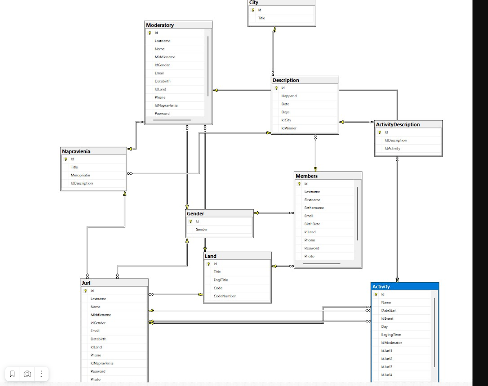
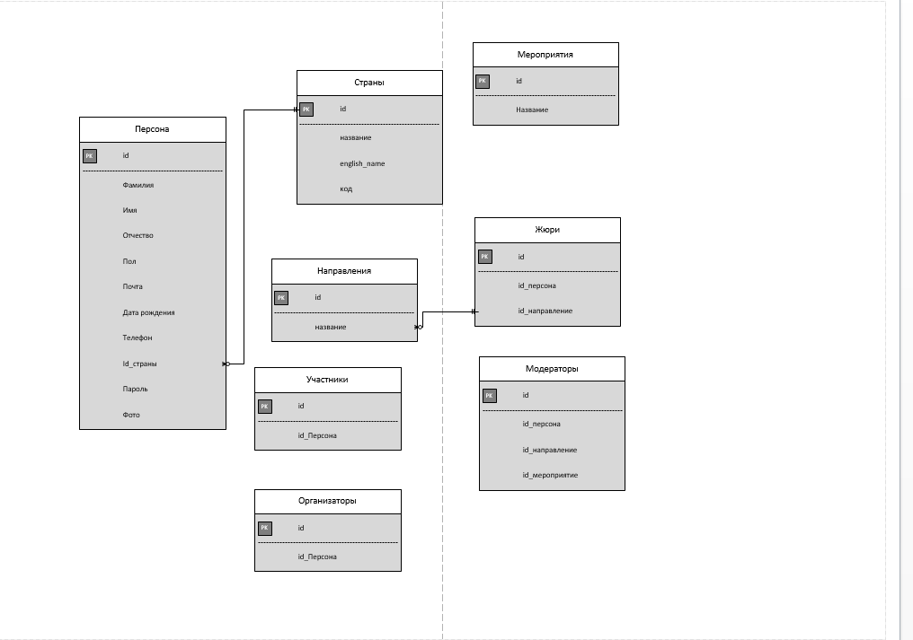

# Demo

$ git config --global core.editor "code --wait"

<kbd>
  
</kbd>

<kbd>
  
</kbd>

- Файл с диаграммой прецедентов должен быть сохранен с именем «Прецеденты_XX.pdf», где ХХ – номер рабочего места.
- Файл с ER-диаграммой должен быть сохранен с именем «ER_XX.pdf», где ХХ – номер рабочего места.
- Файл словаря должен быть сохранен с именем «Data Dictionary_XX.pdf», где ХХ – номер рабочего места.
- Файл с руководством пользователя должен быть сохранен с именем «Руководство пользователя_XX.pdf», где ХХ – номер рабочего места.