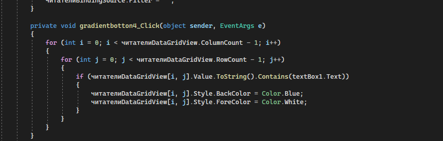
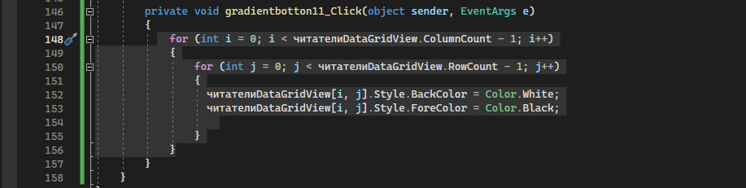
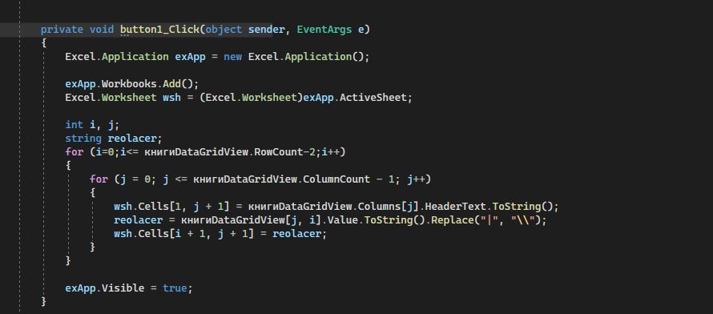

1.добавить
книгиBindingSource.AddNew();

2.Сохранить
this.Validate();
this.книгиBindingSource.EndEdit();
this.tableAdapterManager.UpdateAll(this.бД_БиблиотекиDataSet);

2.Вниз верх
Вниз-издательстваBindingSource.MoveNext();
верх-издательстваBindingSource.MovePrevious();

3.Удаление
издательстваBindingSource.RemoveCurrent();

4.Поиск 
<kbd>
  
</kbd>

5.Сброс поиска 
<kbd>
  
</kbd>

6.Exele

            Excel.Application exApp = new Excel.Application();
            exApp.Workbooks.Add();
            Excel.Worksheet wsh = (Excel.Worksheet)exApp.ActiveSheet;

            int i, j;
            string reolacer;
            for (i=0;i<= книгиDataGridView.RowCount-2;i++)
            {
                for (j = 0; j <= книгиDataGridView.ColumnCount - 1; j++)
                {
                    wsh.Cells[1, j + 1] = книгиDataGridView.Columns[j].HeaderText.ToString();
                    reolacer = книгиDataGridView[j, i].Value.ToString().Replace("|", "\\");
                    wsh.Cells[i + 1, j + 1] = reolacer;
                }
            }

            exApp.Visible = true;

            
<kbd>
  
</kbd>

7.Gradienbox
    
        using System;
        using System.Collections.Generic;
        using System.ComponentModel;
        using System.Drawing.Drawing2D;
        using System.Drawing;
        using System.Linq;
        using System.Text;
        using System.Threading.Tasks;
        using System.Windows.Forms;

    namespace Biblionela_curs
    { 
    class Gradienbox : Panel
    {
        private Color _firstFillColor;
        private Color _secondFillColor;
        private LinearGradientMode _gradientDirection;

        [Description("Первый цвет для градиентного заполнения"), DefaultValue(typeof(Color), "")]
        public Color ColorFillFirst
        {
            get => _firstFillColor;
            set => _firstFillColor = value;
        }
        [Description("Второй цвет для градиентного заполнения"), DefaultValue(typeof(Color), "")]
        public Color ColorfilliSecond
        {
            get => _secondFillColor;
            set => _secondFillColor = value;
        }
        [Description("Tun (Hanpabnehne) rpaawehta"), DefaultValue(LinearGradientMode.ForwardDiagonal)]
        public LinearGradientMode GradientDirection
        {
            get => _gradientDirection;
            set => _gradientDirection = value;
        }

        protected override void OnPaint(PaintEventArgs e)
        {
            var lgb = new LinearGradientBrush(ClientRectangle, _firstFillColor, _secondFillColor, _gradientDirection);
            var graphics = e.Graphics;
            graphics.FillRectangle(lgb, ClientRectangle);
            e.Graphics.SmoothingMode = SmoothingMode.AntiAlias;
            SetStyle(ControlStyles.ResizeRedraw, true);
            base.OnPaint(e);
        }
    }
}

8.Gradientbotton