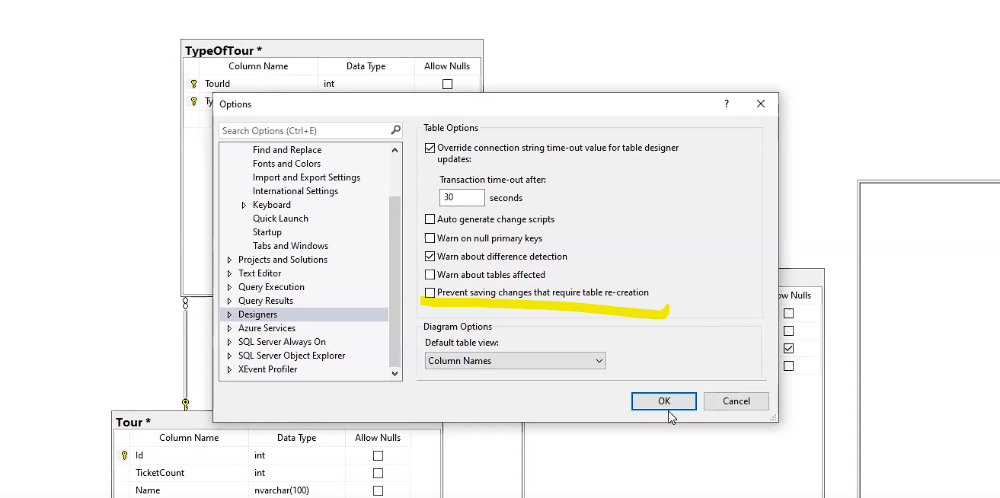

# sql
Первичный ключ
PK, Primary Key. Минимальный набор атрибутов, совокупность значений которых однозначно определяет кортеж в отношении

Внешний ключ
FK, Foreign Key. Столбец или комбинация столбцов, значения которых соответствуют Первичному ключу в другой таблице

SQL
Structured Query Language (язык структурированных запросов). Декларативный язык программирования, применяемый для создания, модификации и управления данными в реляционной базе данных, управляемой соответствующей системой управления базами данных

отключить ошибку
<kbd>
  
</kbd>
включить авто id 
<kbd>
  
</kbd>

Сохранение базы банных 
1.создание скрипта
<kbd>
  
</kbd>
2.выбор пункта 3(слева)
<kbd>
  
</kbd>
3.в дополнитель в этом пунке поставить диаграмы и данные
<kbd>
  
</kbd>
всё

Числовые типы данных

Точные числа

* bigint

* numeric

* bit

* smallint

* decimal

* smallmoney

* int

* tinyint

* money

Приблизительные числа

* float

* real

Дата и время

* date

* datetimeoffset

* datetime2

* smalldatetime

* datetime

* time

Символьные строки

* char

* varchar

* text

Символьные строки в Юникоде

* nchar

* nvarchar

* ntext

Двоичные данные

* binary

* varbinary

* image

Прочие типы данных