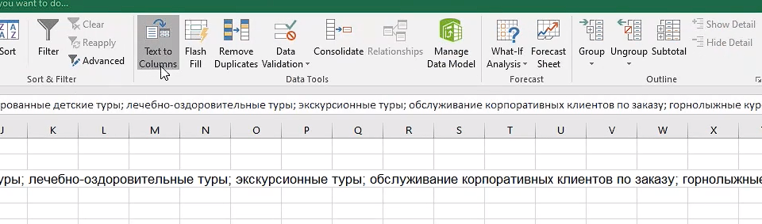
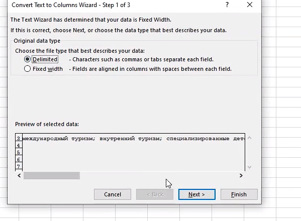
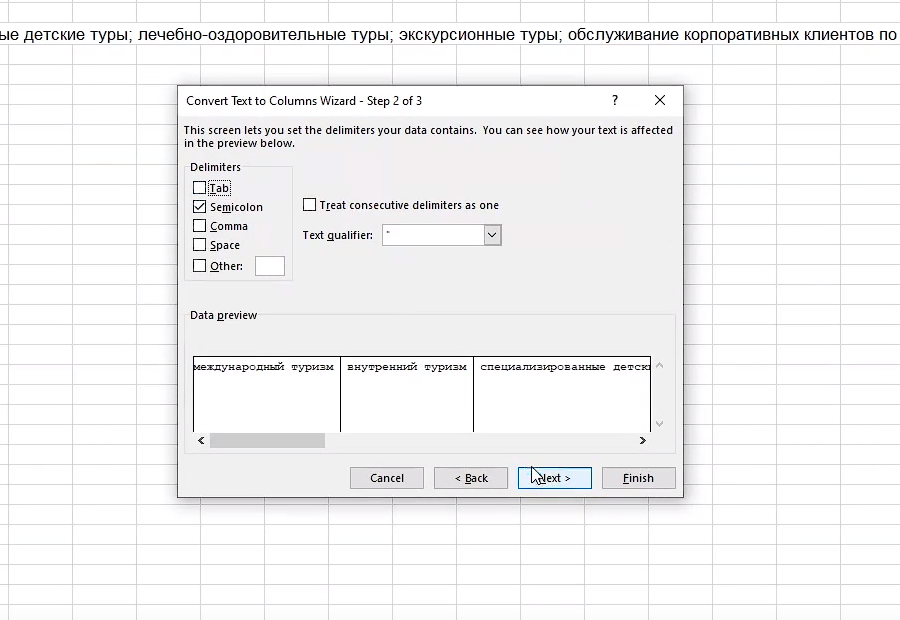
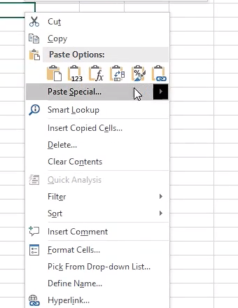
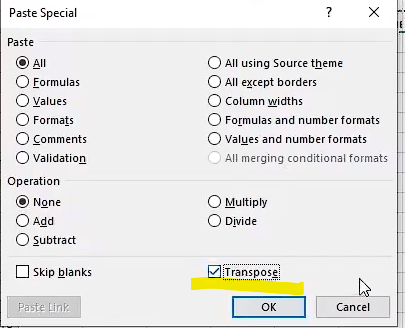
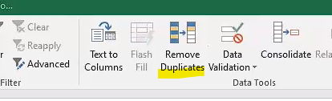
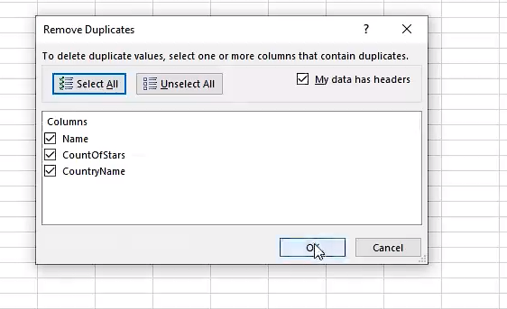

# ИМПОРТ В БАЗУ ДАННЫХ

1способ____________

чтобы разбить текст по столбцам

импорт в sql

="INSERT INTO [dbo].[Hotel]([code],[name],[Me]) VALUES ("&A2&", '"&B2&"', '"&C2&"')"

1чтобы разбить
<kbd>
  
</kbd>
2
<kbd>
  
</kbd>
3
<kbd>
  
</kbd>
4чтобы сделать в столбик
<kbd>
  
</kbd>
5
<kbd>
  
</kbd>

Удаление дубликата 
<kbd>
  
</kbd>
<kbd>
  
</kbd>

