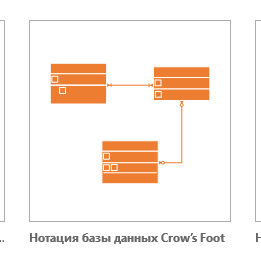
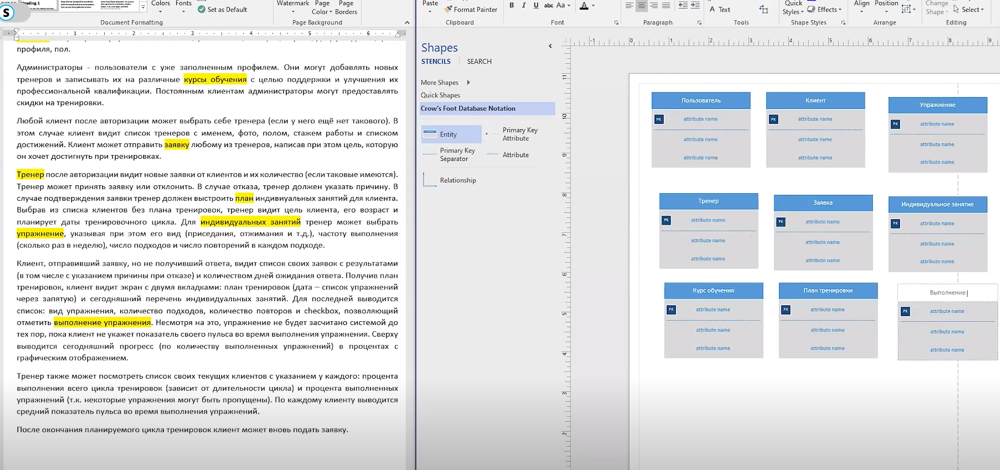
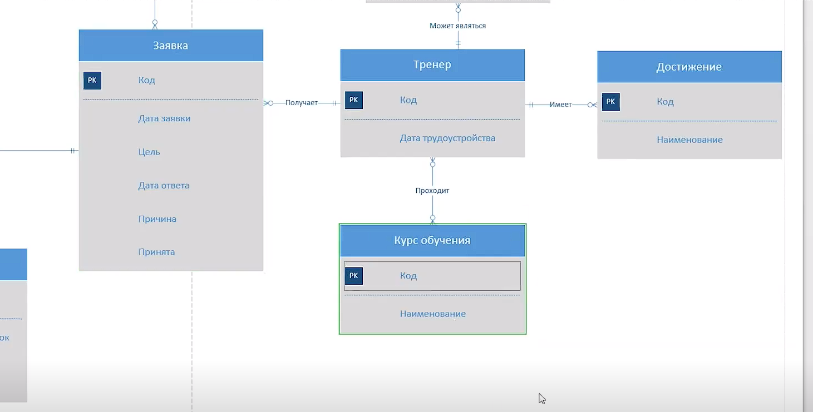
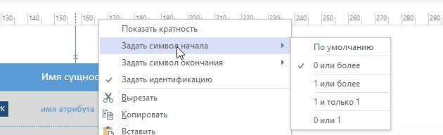

# ER-диаграммы 
Интерфейс, позволяющий двум независимым компонентам программного обеспечения обмениваться информацией

<kbd>
  
</kbd>

Пример 
<kbd>
  
</kbd>

<kbd>
  
</kbd>

<kbd>
  
</kbd>

1
| Название типа | Пример | Комментарий |
|----------|----------|----------|
| Один-к-одному	   | План тренировки должен быть составлен по одной заявке / По заявке может быть составлен один план тренировки	  | План тренировки должен быть составлен по одной заявке / По заявке может быть составлен один план тренировки	   |
| Один-ко-многим	   | План тренировки может включать много индивидуальных занятий / Индивидуальное занятие должно относиться к одному плану тренировки	   | Наиболее часто используемый тип связи
   |
| Многие-ко-многим	    | Тренер может пройти несколько курсов обучения / Курс обучения может быть пройден многими тренерами	   | Используется исключительно в качестве временного типа. При дальнейшей разработке данная связь заменяется на две связи типа «один-ко-многим» путем добавления промежуточной сущности
  |

  <kbd>
  
</kbd>

  <kbd>
  
</kbd>