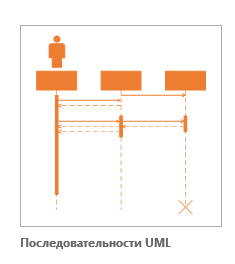
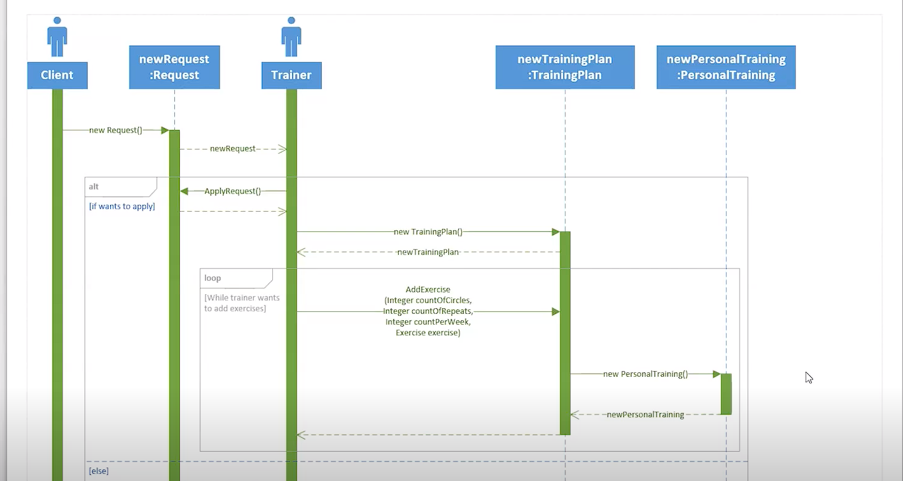
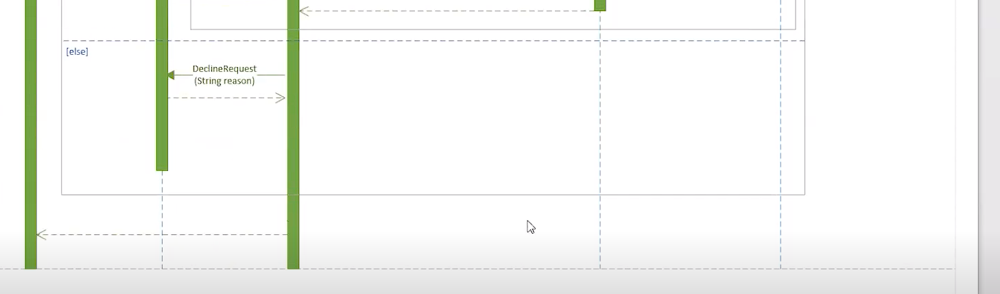

# ПОСЛЕДОВАТЕЛЬНОСТИ UML

Актер
Actor. Роль объекта вне системы, который прямо взаимодействует с ее частью — конкретным элементом

Прецедент
Use Case (вариант использования). Описание поведения системы, когда она взаимодействует с кем-то (или чем-то) из внешней среды

Диаграмма последовательности
Sequence Diagram. Диаграмма, на которой для некоторого набора объектов на единой временной оси показан жизненный цикл какого-либо определенного объекта и взаимодействие актеров ИС в рамках какого-либо определённого прецедента

<kbd>
  
</kbd>

Пример 
<kbd>
  
</kbd>
<kbd>
  
</kbd>

Диаграмма последовательности позволяет изобразить поведение нескольких объектов в рамках одного прецедента
Диаграмма последовательности удобна для представления взаимодействия объектов, но не для точного определения их поведения
Диаграмма показывает экземпляры объектов и сообщения, которыми обмениваются экземпляры в рамках одного прецедента

Объекты обычно подписываются в формате «объект:класс» и изображаются как в виде обычных прямоугольников, так и с использованием дополнительных обозначений. В представленном примере объектами являются запрос, обозначенный прямоугольником, а также тренер и клиент, обозначенные элементом «Актер»