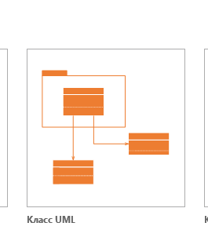

# CLASS DIAGRAM
Class Diagram. Структурная диаграмма языка моделирования UML, демонстрирующая общую структуру иерархии классов системы, их коопераций, атрибутов (полей), методов, интерфейсов и взаимосвязей между ними

<kbd>
  
</kbd>
