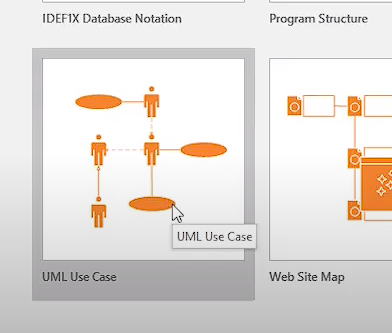
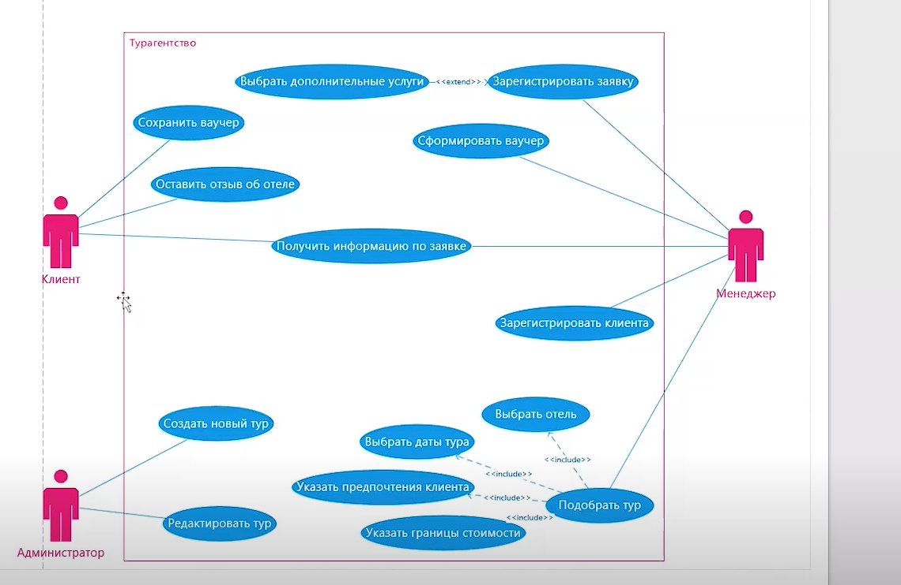

# UseCase
Диаграмма вариантов использования. Диаграмма, отражающая отношения между актерами и прецедентами и являющаяся составной частью модели прецедентов, позволяющей описать систему на концептуальном уровне

Actor
Актер (Use Case). Роль объекта вне системы, который прямо взаимодействует с ее частью — конкретным элементом

Use Case
Вариант использования (прецедент). Описание поведения системы, когда она взаимодействует с кем-то (или чем-то) из внешней среды

Hot Keys
Ctrl + 1 — выделить элемент
Ctrl + 2 — добавить комментарий
Ctrl + 3 — добавить связь между актером и прецедентом

Диаграмма вариантов использования (use case diagram)

Диаграмма классов (class diagram)

Диаграмма состояний (statechart diagram)

Диаграмма последовательности (sequence diagram)

<kbd>
  
</kbd>

Отношение ассоциации — отражает возможность использования актером прецедента
(полоска)

Отношение включения — поведение одного прецедента включается в другой в качестве составного, причем дополняемый вариант использования не сможет выполняться без основного(------->)

Отношение расширения — отражает возможное присоединение одного использования к другому, при этом расширяющий вариант использования выполняется лишь при определенных условиях и не является обязательным для выполнения основного прецедента(<<-------->>)

Отношение обобщения
Заметим, что в нашей системе группы пользователей «Преподаватель» и «Классный руководитель» обладают схожими возможностями. Чтобы изобразить это на диаграмме, мы можем пойти одним из трёх путей:
(______________>)

Пример
<kbd>
  
</kbd>
Название UseCase