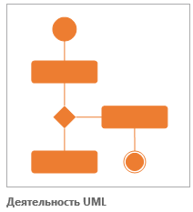
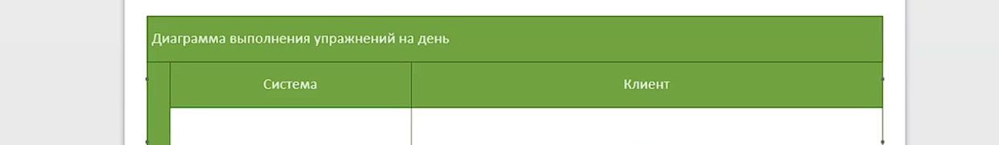
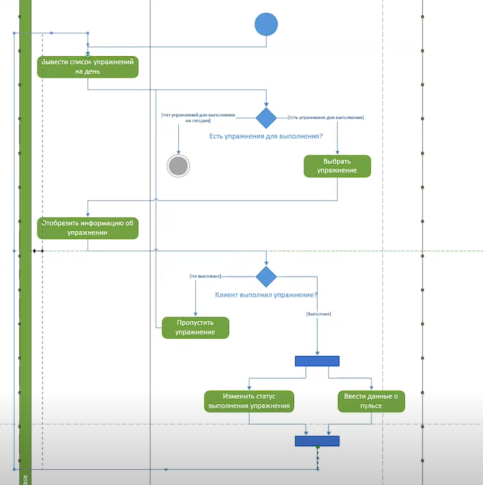

# ACTIVITY DIAGRAM

Activity diagram. Диаграмма для демонстрации рабочего процесса некоторой деятельности, основанной на поэтапных действиях и действиях с поддержкой выбора и параллелизма

<kbd>
  
</kbd>

Пример

<kbd>
  
</kbd>
<kbd>
  
</kbd>