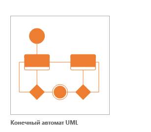
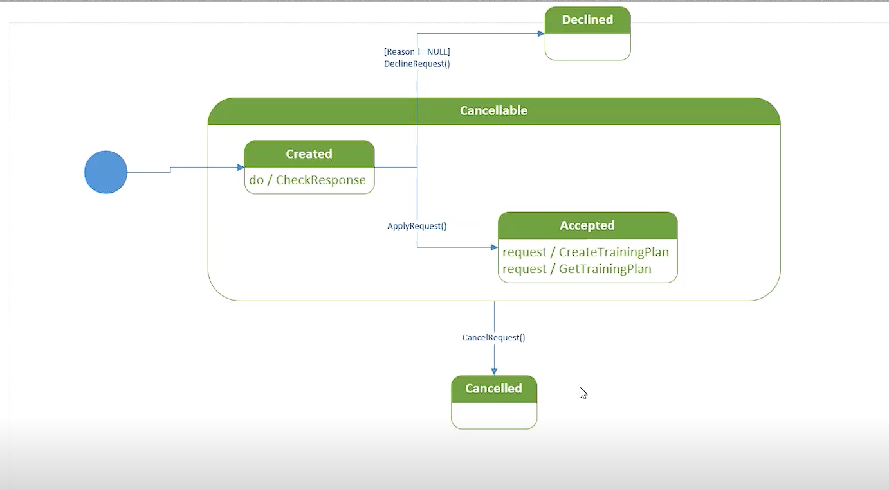

# STATECHART DIAGRAM

Диаграмма состояний
Statechart Diagram. Методология объектно-ориентированного проектирования, предназначенная для представления жизненного цикла объектов в реальном или абстрактном мире

Событие
Event. Сообщение, которое возникает в различных точках исполняемого кода при выполнении определенных условий

Диаграмма состояний UML
Диаграмма состояний позволяет описывать поведение системы
В объектно-ориентированном подходе разрабатывается диаграмма состояний единственного класса, демонстрирующая поведение одного объекта в течение его жизни
Состояние на диаграмме является более абстрактным понятием, чем состояние объекта (последнее есть комбинация всех данных из полей объекта)
Диаграмма позволяет проектировать различные способы реакции на события
Пример построения диаграммы состояний
В данном занятии демонстрируется построение диаграммы состояний заявки клиента. Основные шаги построения диаграммы состояний:

добавление состояний
указание переходов
добавление внутренних активностей
указание подсостояний и суперсостояний

<kbd>
  
</kbd>

Пример
<kbd>
  
</kbd>